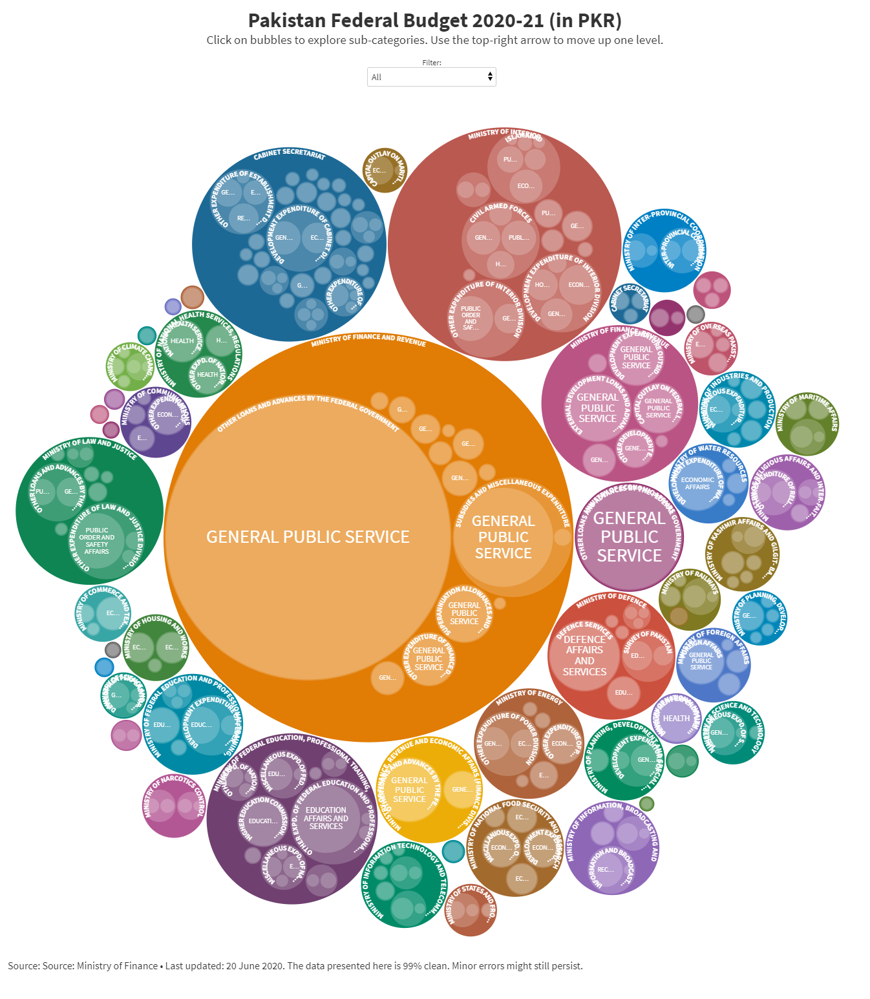
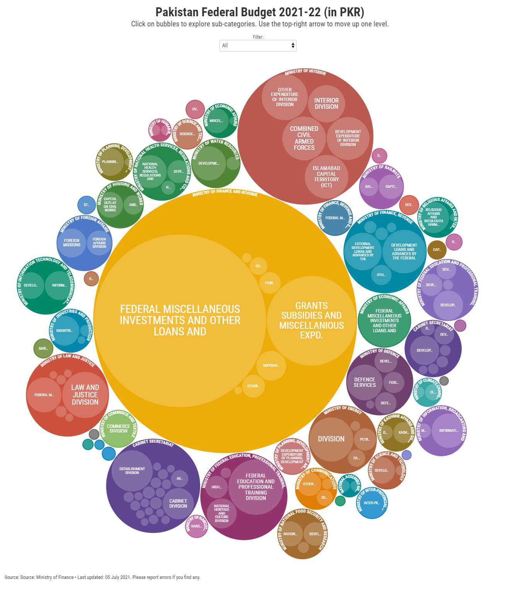

This repository scrapes data from federal budgets that are released as PDFs by the [Ministry of Finance, Government of Pakistan](https://www.finance.gov.pk/)

Invidual budget files are in their respective folders. Master files combine 2020 and 2021 budgets for comparison.

**Note**: The files are generated using pattern recognition scripts, a lot of which had to be fine tuned. The files can contain errors. If you come across some data issues, then please report them.

## :floppy_disk: Data description of the variables

| Variable | Type | Description | 
| --- | --- | --- |
| `year` | num | Year of the budget. E.g. 2021 represents the 2021-2022 budget. | 
| `category` | str | **Current** or **Development** budget | 
| `ID1` | num | The 1st level budget category. Contains nine values.  | 
| `ID1_name` | str | The names of ID1.  | 
| `ID2` | num | The 2nd level budget category. |
| `ID2_name` | str | The names of ID2.  | 
| `ID3` | num | The 3rd level budget category. |
| `ID3_name` | str | The names of ID3.  | 
| `ID4` | num | The 4th level budget category. |
| `ID4_name` | str | The names of ID4.  | 
| `ID5` | num | The 5th level budget category. |
| `ID5_name` | str | The names of ID5.  | 
| `ID6` | num | The 6th level budget category. |
| `ID6_name` | str | The names of ID6. This is the highest disaggregated level.  | 
| `level` | num | The level of the data disaggregation for `ID6`. Level 1 is the total for the `ID6` category. Level 2 adds up to 1. Level 3 adds up to 2. |
| `budget<N>_posts_<N-1>` | num | The number of posts (jobs) in year **<N-1>** in budget of year **<N>**.  | 
| `budget<N>_posts_<N>` | num | The number of posts (jobs) in year **<N>** in budget of year **<N>**.  | 
| `budget<N>_<N-1>` | num | The value in PKR of item `ID6` `level` for year **<N-1>** given in budget of year **<N>**.  | 
| `budget<N>_<N-1>_revised` | num | The revised value in PKR of item `ID6` `level` for year **<N-1>** given in budget of year **<N>**.  | 
| `budget<N>_<N>` | num | The value in PKR of item `ID6` `level` for year **<N>** given in budget of year **<N>**. This is the value of the current budget.  | 

*Note:* When comparing the values across the years remember to deflate them based on inflation.

## Interactive visualizations:

The interactive visualizations are made in [Flourish](https://flourish.studio/), an online dataviz platform. Since this is all open-source, the visualizations can be duplicated and edited:

**2020-2021:** https://public.flourish.studio/visualisation/2841995/

**2021-2022:** https://public.flourish.studio/visualisation/6533369/

 
 
 

Screenshots:

   
